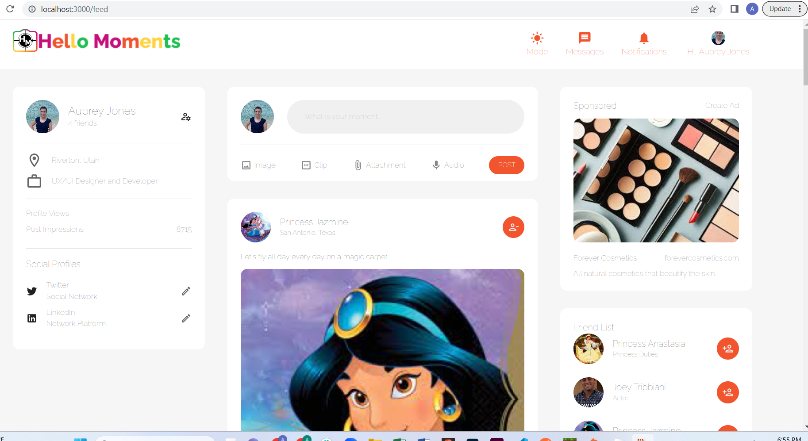
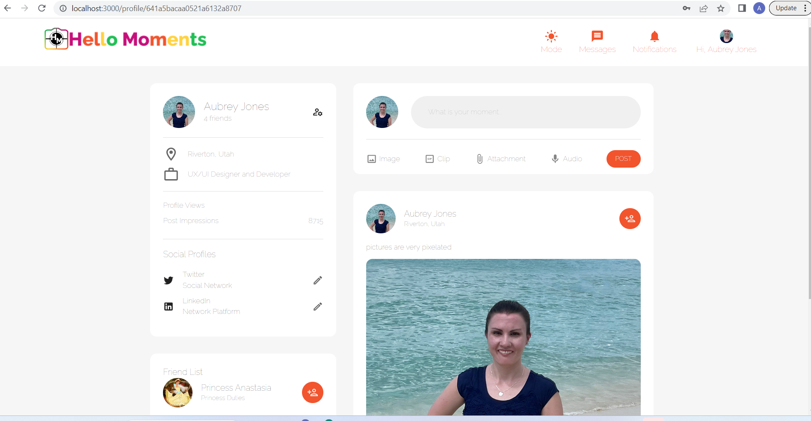
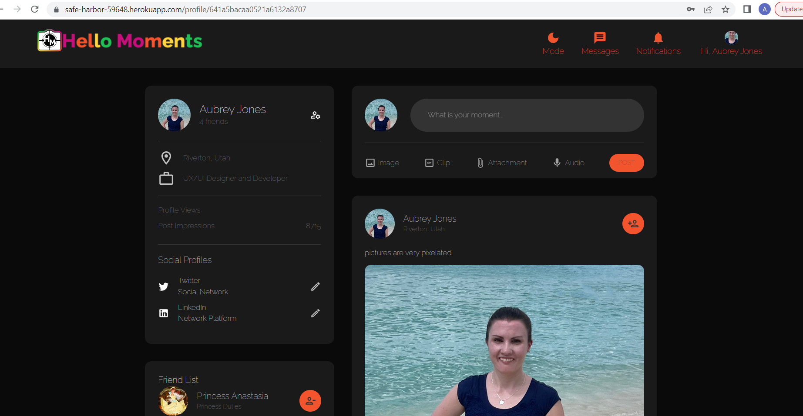

## Project Description

### Hello Moments is a social media app that uses the MERN full stack web development process and CRUD system. 

#### With this web app I learned a lot about styling with MUI themes such as light mode and dark mode. I studied how to deploy to Heroku successfully very carefully while learning a lot about CORS and CORP.  

### Enjoy sharing precious moments with your loved ones from all over the world. 

## Installation Instructions 

1. Clone GitHub Repository 
2. Run npm install (I recommend using npm for this project due to consistency with what I used)
3. Add .env file to root folder
4. Add mongoDB connection string to .env file using MONGO_URI as the ENV variable 
5. Add some random text in quotation marks to a JWT_SECRET ENV variable
6. Run npm run start 
7. View project locally on your computer and enjoy 

## Project Images 

## Project Link 

https://hellomoments.herokuapp.com/

## Credits

##### Huge Thanks and Shout Out to talented Ed Roh for his incredible and current YouTube tutorial:

https://www.youtube.com/watch?v=K8YELRmUb5o

##### And Vivek Kaushal's Medium Heroku Tutorial: 

https://vivek-kaushal.medium.com/deploying-a-mern-web-app-to-heroku-b12c74c8b3c4

## Contact

### Here is my contact info for questions or comments: 

#### GitHub: 

https://github.com/aubreyjonescreatives

